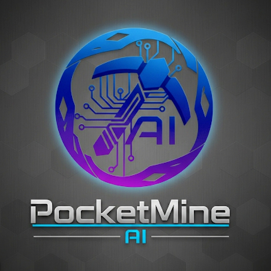

# PMMP-AI Assistant



## 🤖 Advanced AI Assistant for Minecraft Pocket Edition Servers

PMMP-AI is a powerful AI assistant plugin for PocketMine-MP servers that integrates multiple AI providers to enhance your Minecraft server experience. The plugin offers a wide range of features including AI chat, crafting help, building calculations, server information, and more.

[](https://github.com/RenzMc/PMMP-AI/releases/latest)
[](https://github.com/pmmp/PocketMine-MP)
[](LICENSE)

## ✨ Features

- **Multi-Provider AI Integration**: Support for OpenAI, Anthropic, Google AI, OpenRouter, and local AI models
- **Interactive Chat**: Talk directly with AI to get help with Minecraft-related questions
- **Crafting Helper**: Get crafting recipes for any item in the game
- **Building Calculator**: Calculate required materials for your building projects
- **Server Information**: Access server stats, rules, and features
- **Token System**: Optional economy integration with configurable token packages
- **Chat History**: Save and review past conversations with the AI
- **Fully Customizable**: Extensive configuration options for all aspects of the plugin
- **Broadcast System**: Configurable AI tips broadcast to players

## 📋 Requirements

- PocketMine-MP 5.15.0+
- [FormAPI](https://github.com/jojoe77777/FormAPI) plugin
- Economy plugin (optional, for token system): EconomyAPI, BedrockEconomy

## 📥 Installation

1. Download the latest release from the [releases page](https://github.com/RenzMc/PMMP-AI/releases)
2. Place the `.phar` file in your server's `plugins` folder
3. Install the required [FormAPI](https://github.com/jojoe77777/FormAPI) plugin
4. Restart your server
5. Configure the plugin by editing the configuration files in the `plugins/PMMP-AI` folder

## ⚙️ Configuration

PMMP-AI offers extensive configuration options through multiple YAML files:

### config.yml

The main configuration file contains settings for:
- API providers (OpenAI, Anthropic, Google AI, OpenRouter, Local AI)
- AI prompt settings
- Message settings
- Server information
- Token system
- Chat history
- Advanced settings

### forms.yml

The forms configuration file allows you to customize all UI elements:
- Form titles and content
- Button texts and colors
- Button textures
- Form layouts
- Text formatting

### fiturserver.yml

This file contains information about your server's features that the AI can use to help players:
- Economy features
- Land protection systems
- Teleportation commands
- Custom enchantments
- Minigames
- Voting systems
- Ranks and more

## 🎮 Usage

### Player Commands

- `/ai` - Open the main AI Assistant interface

### Admin Commands

- `/ai reload` - Reload the plugin configuration
- `/ai settings` - Open the admin settings panel
- `/ai tokens <player> <amount>` - Give tokens to a player

## 🎨 Customization

### Form Customization

All forms can be fully customized through the `forms.yml` file:

```yaml
# Example: Customizing the main form
main_form:
  title: "My Custom AI"
  content: "Welcome to my custom AI assistant!"
  buttons:
    chat:
      text: "Talk to AI"
      color: "{primary}"
      texture: "textures/ui/chat_icon"
```

### Button Textures

You can customize button textures using Minecraft's built-in textures or your own resource pack:

```yaml
button_textures:
  chat: "textures/ui/chat_icon"
  crafting: "textures/ui/crafting_icon"
  building: "textures/ui/building_icon"
```

### Text Formatting

Customize text colors and formatting throughout the plugin:

```yaml
text_formatting:
  title: "&l&b"       # Bold Aqua
  subtitle: "&l&e"    # Bold Yellow
  heading: "&l&6"     # Bold Gold
  content: "&7"       # Gray
```

## 🔧 API Integration

### OpenAI Setup

1. Get an API key from [OpenAI](https://platform.openai.com/)
2. Add your API key to the `config.yml` file:

```yaml
api_providers:
  default_provider: "openai"
  openai:
    enabled: true
    api_key: "YOUR_OPENAI_API_KEY"
    model: "gpt-3.5-turbo"
```

### Other Providers

The plugin also supports:
- [Anthropic Claude](https://www.anthropic.com/)
- [Google AI (Gemini)](https://ai.google.dev/)
- [OpenRouter](https://openrouter.ai/)
- Local AI models (self-hosted)

## 📊 Token System

The plugin includes an optional token system that integrates with economy plugins:

- Players receive free daily tokens
- Additional tokens can be purchased with in-game currency
- Configurable token packages and prices
- Support for multiple economy plugins

## 📝 License

This project is licensed under the [MIT License](LICENSE).

## 👨‍💻 Author

- **Renz** - [GitHub](https://github.com/RenzMc)

## 🙏 Acknowledgements

- [PocketMine-MP](https://github.com/pmmp/PocketMine-MP) team for the amazing server software
- [jojoe77777](https://github.com/jojoe77777) for the FormAPI plugin
- All contributors and testers who helped improve this plugin
